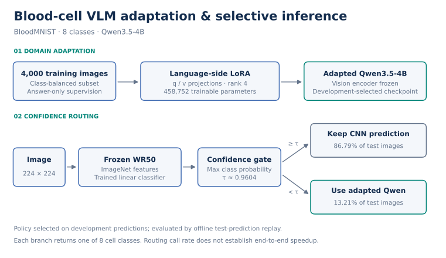

# BloodRoute：血细胞领域适配与置信度路由

探索两个问题：通用视觉语言模型能否通过少量标注图像适应血细胞形态分类？冻结 CNN 与领域适配后的 VLM，能否通过选择性复核取得互补收益？

本项目使用 BloodMNIST 八类细胞图像，对 **Qwen3.5-4B** 进行语言侧 LoRA 微调，并探索 **WideResNet-50-2 置信度门控 → VLM 复核**。任务是公开数据上的形态分类实验。

## 主要结果

所有结果来自同一批 **3,421 张官方测试图**。SFT 前后使用相同提示词、图像处理与解码设置。

| 方法 | Accuracy | Macro-F1 | VLM 调用比例 |
|---|---:|---:|---:|
| 原始 Qwen3.5-4B | 58.52% | 55.40% | 100% |
| Qwen3.5-4B + 血细胞 LoRA | 94.68% | 94.01% | 100% |
| 冻结 WR50 特征 + 线性分类器 | 93.66% | 93.25% | 0% |
| **CNN–VLM 置信度路由** | **96.32%** | **96.05%** | **13.21%** |


- **领域适配：** 4,000 张按类别分层采样的训练图像，458,752 个可训练 LoRA 参数；测试准确率提升 **36.16 个百分点**。
- **选择性复核：** 路由调用 VLM 452 次，相比全量 VLM 少 **86.79%**，准确率高 **1.64 个百分点**。
- **净纠错：** 路由纠正冻结 CNN 分类器的 125 个错误、引入 34 个错误，净多答对 91 张。

路由结果是对已保存预测的离线回放，调用比例不等同于端到端加速比。[实验记录](docs/EXPERIMENTS.md)提供完整对照，包括全量微调 CNN；[评估协议](docs/PROTOCOL.md)说明数据划分、选模和阈值选择。

## 外域回归检查

在固定的 723 张 VisA 工业图像子集（643 正常 / 80 异常）上，对原始模型与血细胞 LoRA 做同口径二分类评估。Balanced accuracy 为 **53.13% → 55.00%**，异常召回率为 **6.25% → 10.00%**；逐图比较纠正 3 张、没有新增错误，均无血细胞类别词误输出。**该子集未观察到退化**；两者异常召回仍低，此结果不代表通用能力全面保持。详见 [实验记录](docs/EXPERIMENTS.md)。

## 技术栈

| 模块 | 技术与用途 |
|---|---|
| 多模态模型 | **Qwen3.5-4B · Hugging Face Transformers**：图文输入，生成八类细胞标签 |
| 领域微调 | **PyTorch · PEFT / LoRA**：语言侧 q/v 投影，rank=4；冻结视觉编码器，答案及 EOS 监督 |
| 训练配置 | **BF16 · AdamW**：2,000 → 4,000 图扩量续训，按开发集指标选择 checkpoint |
| CNN 基线 | **torchvision · WideResNet-50-2**：ImageNet 预训练主干提取冻结特征 |
| 线性分类器 | **scikit-learn**：StandardScaler + LogisticRegression，输出八类概率 |
| 选择性路由 | **NumPy · 置信度阈值**：开发集选择门控策略，低置信度采用 VLM 预测；测试以离线回放验证 |
| 数据处理 | **NumPy · Pillow · JSON**：NPZ 转 PNG、格式校验、类别均衡采样、图文指令构建及来源索引管理 |
| 实验运行 | **Slurm · RTX 3090**：单 GPU 作业脚本；**Matplotlib** 生成结果图 |

环境版本见 [requirements.txt](requirements.txt)，训练与推理命令见 [复现步骤](docs/REPRODUCE.md)。

## 方法



### 领域微调

将每张图像与固定八分类问题、官方类别标签组成一条指令样本。视觉编码器冻结，仅在语言侧 full-attention 层的 `q_proj`、`v_proj` 上添加 LoRA：`rank=4`、`alpha=8`、`dropout=0.05`。采用 BF16 训练，只监督答案及 EOS。

先以 2,000 张图像完成试训，再扩量至 4,000 张，并从试训第一轮适配器以较低学习率续训。新增训练每 1,000 步评估一次；报告模型是开发集选定的新增第 3,000 步 checkpoint。

### 置信度门控

CNN 基线使用 ImageNet 预训练 WR50 的冻结特征，在 4,000 张训练图上拟合 StandardScaler 与八分类 Logistic Regression。在开发集比较最高类别概率和前两类概率差，并冻结规则：

```text
max(CNN class probabilities) < 0.960442447942174
    → 使用 VLM 的分类结果
否则
    → 保留 CNN 的分类结果
```

这个规则不需要额外训练一个路由模型。脚本支持开发集选型与测试集回放，尚未提供医学路由的在线串联服务或端到端测速。

## 数据与复现

- 数据：[MedMNIST+ BloodMNIST 224](https://medmnist.com/)，八分类。
- 训练：官方 train 中每类 500 张，共 4,000 张。
- 开发：官方 val 中每类 50 张，共 400 张。
- 测试：官方 test 全量 3,421 张，保留自然类别分布。
- 基础模型：本地 Qwen3.5-4B 权重；CNN：ImageNet 预训练 WideResNet-50-2。

需要自己准备数据和模型文件，仓库不包含原始数据、模型权重或服务器运行目录。代码整理自已完成的实验；公开副本的静态检查与合成回放检查不等同于重新完成全套 GPU 训练。

```bash
python -m venv .venv
source .venv/bin/activate
pip install -r requirements.txt
export MODEL_DIR=/path/to/Qwen3.5-4B
```

按 [复现步骤](docs/REPRODUCE.md)依次执行数据构建、试训、续训、固定模型测试和路由回放。脚本要求新输出目录，以保留各次实验结果。

路由的无模型检查：`python -m unittest discover -s tests -v`，覆盖严格阈值边界、无效预测计错与样本 ID 配对。

## 目录

```text
assets/                  # 方法与结果图（SVG / PNG）
scripts/                 # VLM 公共函数、训练、测试和路由回放
medical_blood_pilot/      # 数据构建、冻结与微调 CNN 对照
configs/slurm/           # 单 GPU 调度示例
results/                 # 聚合实验结果，不包含逐图预测或权重
docs/PROTOCOL.md         # 数据、选模、指标与路由协议
docs/EXPERIMENTS.md      # 完整实验对照
docs/REPRODUCE.md        # 命令与运行步骤
```

## 项目范围

本项目研究 VLM 的领域适配与选择性调用，不将八类形态识别等同于疾病诊断。全量微调 CNN 的结果见完整实验表。已完成一个工业图像子集的外域回归检查；更广泛的能力保持评估、LoRA rank/作用层系统消融及医学路由端到端测速仍待完成。

## License

代码采用 [MIT License](LICENSE)。BloodMNIST 数据遵循其 CC BY 4.0 许可及来源引用要求，模型权重遵循各自许可。
