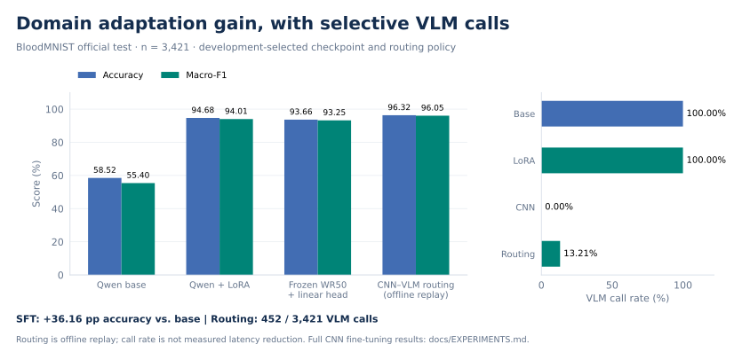

# 实验结果

## 官方测试集

| 模型或策略 | 正确/总数 | Accuracy | Macro-F1 | Balanced accuracy |
|---|---:|---:|---:|---:|
| Qwen3.5-4B 原始模型 | 2002/3421 | 58.5209% | 55.4030% | 63.2656% |
| Qwen3.5-4B 血细胞 LoRA | 3239/3421 | 94.6799% | 94.0096% | 94.3345% |
| 冻结 WR50 + 线性分类器 | 3204/3421 | 93.6568% | 93.2454% | 93.6758% |
| CNN–VLM 路由，离线回放 | 3295/3421 | 96.3169% | 96.0538% | 96.3315% |
| 全量微调 WR50 | 3355/3421 | 98.0707% | 98.1055% | 98.3654% |

VLM 和 CNN 的测试结果来自实际推理，路由来自配对预测回放。各模型 invalid 均为 0。全量微调 CNN 是本纯八分类实验中表现最好的方案；路由相对冻结 CNN 和单独 VLM 取得互补收益，仍比全量微调 CNN 低 1.7539 个 accuracy 百分点。机器可读结果见 [主实验指标](../results/metrics.json)。

## 适配器选型：固定 400 图开发集

初训最佳适配器准确率 91.50%。扩量续训后，新增 step1000=95.00%、step2000=94.50%、step3000=96.75%、step4000=95.50%、step5000=96.50%、step6000=96.50%。最终跑满新增 8,000 步，开发集最佳仍为 step3000（macro-F1 96.7449%）。最终报告采用这一固定模型。

初训与扩量同时改变了数据量、学习率和训练过程。这一实验记录整体训练方案的收益；独立的 rank 容量对照见下一节。

## 独立 rank 消融：400 图开发集

三组从同一 Qwen3.5-4B base 新建 LoRA，使用相同 4,000 图训练集、400 图开发集和 8,000 步训练计划，固定 alpha/r=2。每 1,000 步评估，按 macro-F1、accuracy、较早 step 选择。

| Rank | Alpha | 可训练参数 | 最佳 step | Dev Macro-F1 | Dev Accuracy |
|---:|---:|---:|---:|---:|---:|
| 2 | 4 | 229,376 | 8,000 | 96.9708% | 97.00% |
| 4 | 8 | 458,752 | 5,000 | 97.0140% | 97.00% |
| 8 | 16 | 917,504 | 8,000 | 96.6821% | 96.75% |

r=4 的开发集 macro-F1 点估计最高，r=2 仅低 0.0432 个百分点，r=8 未带来收益。这支持保留 r=4 为默认容量点，并将 r=2 视作更省参数的近似方案。当前为单 seed 对照，细小差异需跨 seed 验证。

本轮只评估开发集，与热启动主模型具有不同训练历史；其 checkpoint 和分数独立记录，首页官方测试指标保持原主模型结果。设置、结果与可核算混淆矩阵见 [Rank 消融](RANK_ABLATION.md)。

## 配对错误

SFT 相对原始 VLM：纠正 1,274、损坏 37、双方都对 1,965、双方都错 145，净增加 1,237 个正确答案。

路由相对冻结 CNN：纠正 125、损坏 34，净增加 91 个正确答案。路由相对全量适配 VLM：净增加 56 个正确答案。VLM 调用数为 452，调用比例 13.2125%。

## 外域回归：VisA 工业图像二分类

在固定的 723 张工业图像子集上，对原始 Qwen3.5-4B 与血细胞 LoRA step_03000 做配对推理。子集包含 capsules（241 正常 / 40 异常）和 pcb1（402 正常 / 40 异常），共 643 张正常、80 张异常。此结果不用于重新选择 checkpoint。

| 指标 | 原始模型 | 血细胞 LoRA |
|---|---:|---:|
| Balanced accuracy | 53.125% | 55.000% |
| 异常召回率 | 6.25%（5/80） | 10.00%（8/80） |
| 正常图误报率 | 0% | 0% |
| Accuracy | 89.63%（648/723） | 90.04%（651/723） |
| 无效输出数 | 0 | 0 |
| 原始回答含血细胞类别词的数量 | 0 | 0 |

配对结果：双方均正确 648 张、双方均错误 72 张，LoRA 纠正 3 张、没有新增错误。两次推理均采用 greedy、关闭 thinking、max_new_tokens=32，像素预算为 65,536–200,704。

**该子集未观察到退化。** 类别分布偏向正常图，全部预测正常即可获得 88.94% accuracy，因此优先看 balanced accuracy 和异常召回。两者异常检测能力仍弱，本项仅为有限外域回归证据，不代表通用能力全面保持，也不是整个 VisA 数据集的性能结论。聚合记录见 [外域指标](../results/external_domain_metrics.json)。

## 性能与尚待完成项

固定 LoRA 全量推理的单图端到端平均耗时约 511.84 ms、P95 638.42 ms，包含读取图像、处理、生成与解码；模型加载不计入单图耗时。测试 GPU 为 RTX 3090。

尚未报告医学路由端到端速度、服务吞吐量或等比例成本降低。外域回归结果见上节，更广泛的能力保持评估仍待完成。

本目录记录聚合实验结果，数据与完整模型文件不随代码包分发。
